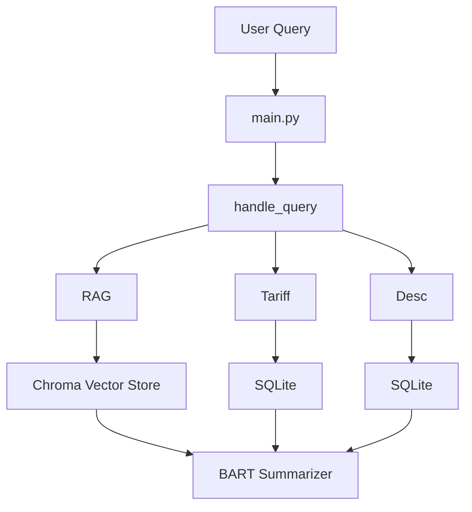

# 🤖 TariffBot - HTS AI Agent for TechStaX

## 📘 Overview
TariffBot is a Python-based AI agent designed for trade compliance, capable of answering trade-related questions, calculating customs duties, and retrieving Harmonized Tariff Schedule (HTS) codes. Built for the TechStaX challenge, it leverages a Chroma vector store for retrieval-augmented generation (RAG), SQLite for HTS data storage, and the BART model for concise responses.

## 🚀 Features
- **RAG Queries**: Answers trade questions (e.g., "What is the United States-Israel Free Trade Agreement?") using a Chroma vector store with 3591 chunks from `General Notes.pdf`.
- **Tariff Calculations**: Computes duties based on HTS code, cost, weight, and quantity (e.g., "HTS code 0101.30.00.00, cost $10000, 500kg, 24 units").
- **Description Lookups**: Retrieves HTS codes by product description (e.g., "What's the HTS code for donkeys?") using SQLite.
- **Modular Design**: Integrates langchain, pandas, SQLite, and transformers for robust performance.

## 🧩 Architecture
TariffBot processes queries through three pipelines: RAG, tariff calculation, and description lookup. Below is an ASCII diagram of the workflow:

## 🧠 Pipeline Breakdown

### 🔍 RAG Pipeline
- **Input**: Trade-related query (e.g., "What is the US-Korea FTA?")
- **Steps**:
  - Embeds query with `sentence-transformers/all-MiniLM-L6-v2`
  - Searches 3591 indexed chunks in Chroma DB (from `General Notes.pdf`)
  - Uses BART model (`facebook/bart-large-cnn`) to summarize relevant context

### 💰 Tariff Calculation Pipeline
- **Input**: HTS code + cost + weight + quantity
- **Steps**:
  - Parses and validates numeric inputs
  - Retrieves duty rates from SQLite (`hts_data.db`)
  - Applies formula:  
    `Duty = (Ad Valorem % * Cost) + (Rate per Unit * Quantity) + (Rate per Kg * Weight)`

### 🔎 HTS Description Lookup Pipeline
- **Input**: Product description (e.g., "What’s the HTS code for donkeys?")
- **Steps**:
  - Case-insensitive search in `hts_data.db` using `LIKE %...%`
  - Returns all matching HTS codes and descriptions

## 🧱 Components

- **main.py**: Entry point, query parsing, and routing
- **rag_tool.py**: RAG logic and Chroma vector store integration
- **tariff_calc.py**: Parses input and computes duties
- **hts_db.py**: Description-based lookups from SQLite
- **Chroma DB**: Holds embedded chunks from HTS General Notes
- **SQLite (hts_data.db)**: Stores duty rates and HTS code details
- **BART**: Summarization model for concise and informative answers

---

## ⚙️ Setup

### 📋 Prerequisites
- 🐍 Python 3.10 *(avoid 3.13 due to package issues)*
- 🧪 `venv` (virtual environment)
- 🛠️ Git

---
